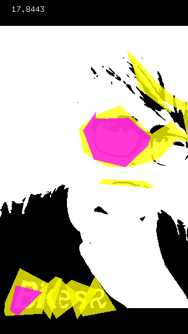
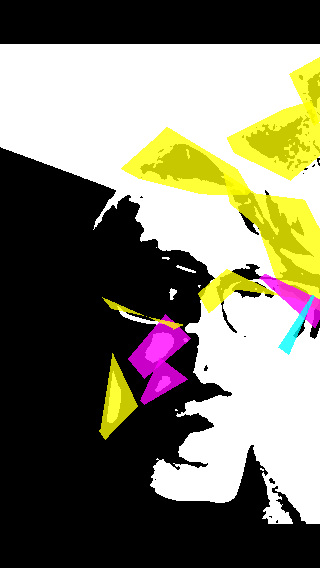

Polyfy (formerly known as "Super Polygonal Selfie") is a little app that creates pictures with a mod art flair.

It is essentially a combination of camera filters that can combined and tweaked in a multitude of ways to create mini works of art. The showcase feature is the polygon color effect, which draws colored polygons on top of a base image using contour detection. It ends up looking something like this:

All of the effects in Polyfy have at least one driver that allows to control it, driving the intensity up or down. Three different color palettes for the polygon effect will be supported at launch (triadic, tetratic, and analogous), in addition to the default average color setting.

But we couldn't stop there; no, we had to do something more, had to one-up ourselves: animated GIFS. Polyfy wouldn't be complete without the ability to snap an animated GIF, and we must say, it completely changes the feel of the app. So you can produce short animations like this:

and send to your friends or post on the interwebs. Animated GIF configuration options will be slim to none at launch, but if we get enough interest, we are already planning on adding duration and framerate options in our first update.

We hope that you enjoy Polyfy as much as we do. We look forward to seeing what kind of works of art you all can create with it! If you have any questions about how to use Polyfy, you can tap on the help link in the app or click [here](/articles/polyfy-help/).
